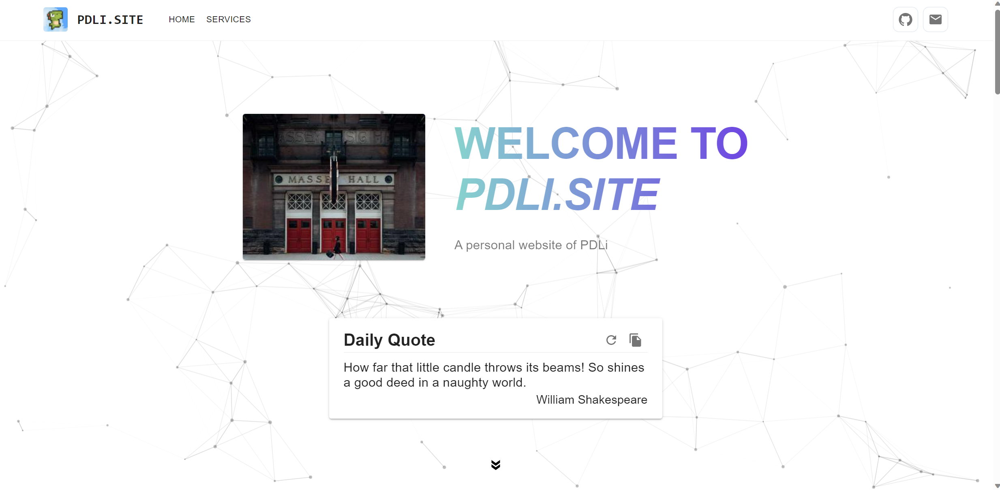
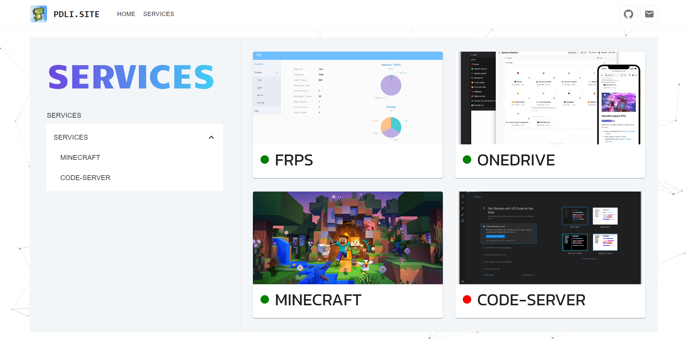
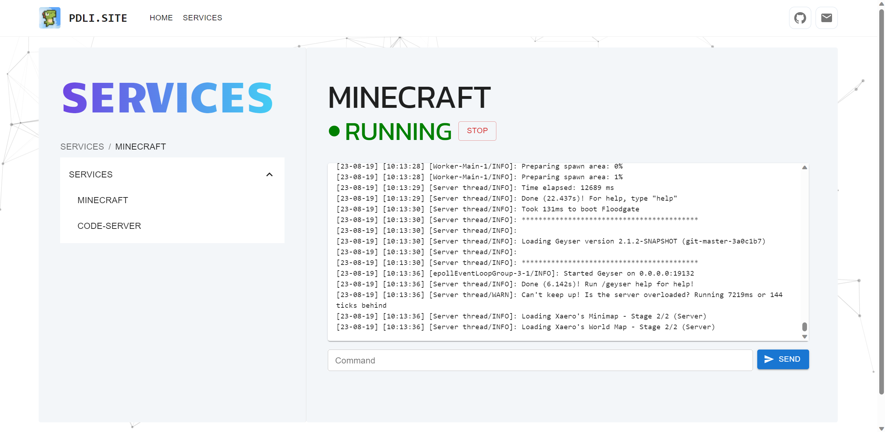

# PDLI.SITE

## :wave: Introduction

This is my personal website / profile project built using Vite + React + Typescript + MUI

## :fire: Features

- Introduction of myself
- Quickly check the status of various services running on my server, and view log & send commands to my Minecraft server
- Comments system using **giscus** powered by GitHub Discussions

## :star2: Demo

- /home


- /services


- /services/minecraft

  
## :hammer_and_wrench: Built With

- [Vite](https://vitejs.dev/)
- [React](https://reactjs.org/)
- [React Router](https://reactrouter.com/)
- [React Spring](https://react-spring.dev/)
- [MUI](https://mui.com/)
- [SignalR](https://dotnet.microsoft.com/apps/aspnet/signalr)
- [tsparticles](https://particles.js.org/)
- [giscus](https://giscus.app/)

## :rocket: Getting Started

**Requirements:**

- Node.js 14+
  
**Run locally:**

```bash
npm install
npm run dev
```

Then open <http://localhost:5173> in your browser.

## :memo: TODOS

- [x] Add dark mode
- [ ] Add Chinese language support
- [ ] Add code highlight for log
- [ ] ... more features

## :gear: Backend

[PDLISiteAPI](https://github.com/llipengda/pdli-site-api) - The backend of this project

## :page_facing_up: License

[MIT](LICENSE)
